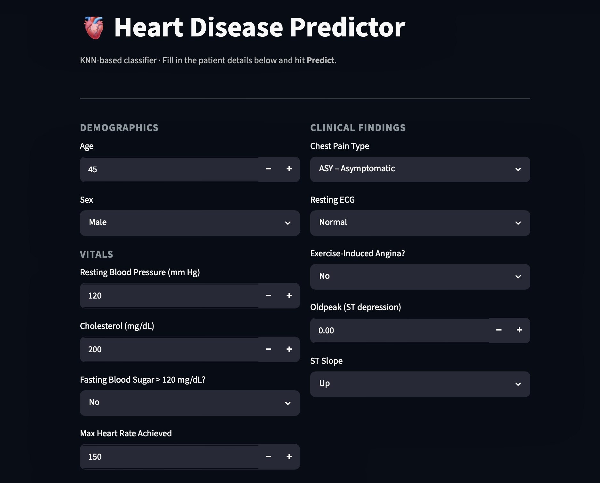
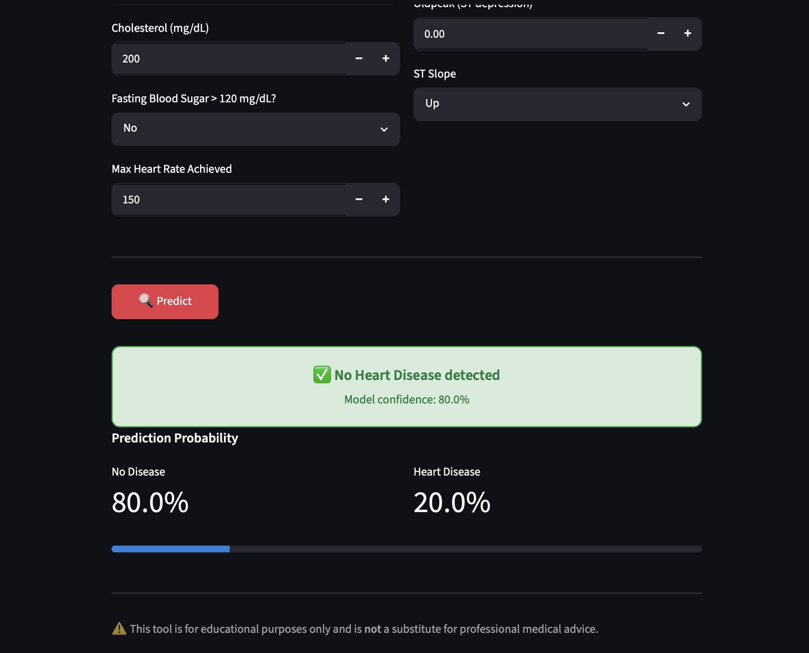

# AI-Powered Heart Disease Risk Assessment System

An end-to-end Machine Learning application that predicts the likelihood of heart disease using a K-Nearest Neighbors classifier.

## Application Preview

## Features

- Interactive Streamlit interface
- Real-time predictions
- Confidence scores
- Data preprocessing pipeline
- Scikit-Learn based model

## Tech Stack

- Python
- NumPy
- Pandas
- Scikit-Learn
- Streamlit

## Project Structure

app.py → Streamlit UI

KNN_heart.pkl → Trained model ( Best fit for this )

scaler.pkl → Feature scaler

columns.pkl → Encoded feature columns

## Future Improvements

- SHAP Explainability
- Model Comparison Dashboard
- Cloud Deployment
