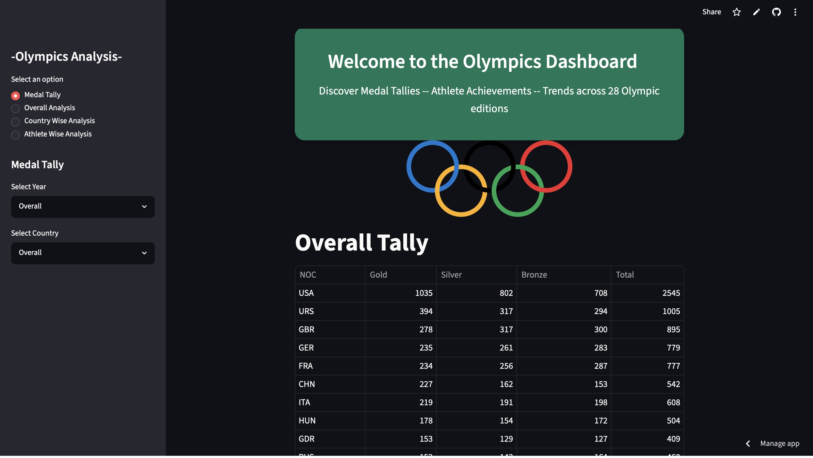

#  Olympics Analysis Dashboard

An interactive data analysis and visualization dashboard built with **Python**, **Streamlit**, **Pandas**, **Plotly**, and **Seaborn** using 120 years of Olympic Games data.
---
## Dashboard Preview

<p align="center">
  
</p>

---
##  Live Demo
A fully interactive version of the project is deployed below:
👉 **[Launch Application](https://machinelearningprojects-exspmrqjrpzfclodq9hkeo.streamlit.app/)**
> Feel free to explore the dashboard and interact with the model in real time.
---

##  Overview

This project explores historical Olympic data from 1896 to 2016, providing insights into athlete performance, country-wise medal tallies, participation trends, and sport-specific statistics through an interactive web application.

The dashboard allows users to:

* View overall Olympic statistics
* Analyze medal tallies by year and country
* Explore country-wise Olympic performance
* Track athlete participation trends
* Visualize sport and event distributions
* Discover the most successful athletes and nations
* Generate interactive charts and heatmaps

---

##  Features

###  Medal Tally Analysis

* Overall medal tally
* Country-wise medal tally
* Year-wise medal tally
* Interactive filtering

###  Overall Olympic Analysis

* Number of editions
* Host cities
* Participating nations
* Events and sports statistics
* Athletes participation trends

###  Country Analysis

* Country performance over time
* Sport-wise strengths
* Medal distribution heatmaps
* Top-performing athletes by country

###  Athlete Analysis

* Most successful athletes
* Age distribution analysis
* Height vs Weight analysis
* Gender participation trends

---

## 📂 Dataset

Dataset Used:

**120 Years of Olympic History: Athletes and Results**

Files:

* `athlete_events.csv`
* `noc_regions.csv`

Source:
https://www.kaggle.com/heesoo37/120-years-of-olympic-history-athletes-and-results

---


## 📁 Project Structure

```text
Olympics_Analysis/
│
├── Data/
│   ├── athlete_events.csv
│   └── noc_regions.csv
│
├── helper.py
├── preprocessor.py
├── main_app.py
├── requirements.txt
└── README.md
```

---

## ⚙️ Installation

Clone the repository:

```bash
git clone https://github.com/arzaanxeng/Machine_Learning_Projects.git
```

Navigate to the project directory:

```bash
cd Machine_Learning_Projects/Major_Projects/Olympics_Analysis
```

Install dependencies:

```bash
pip install -r requirements.txt
```

Run the Streamlit application:

```bash
streamlit run main_app.py
```

---

##  Sample Insights

* USA dominates the overall Olympic medal tally.
* Participation has steadily increased across Olympic editions.
* Certain countries exhibit strong specialization in specific sports.
* Female athlete participation has grown significantly over time.

---

##  Future Improvements
* Olympic medal prediction using Machine Learning
* Country-wise medal forecasting
* Interactive world maps
---

## 👨‍💻 Author

**Arzaan**

If you found this project useful, consider giving it a ⭐ on GitHub.
